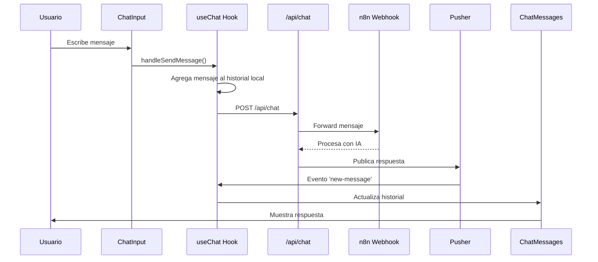

# Documento de Arquitectura - IngeLink Chatbot

## 1. Resumen

Este documento describe la arquitectura del proyecto IngeLink Chatbot, una aplicación de chat en tiempo real construida con Next.js, React y TypeScript. La aplicación sigue una arquitectura por capas para separar las responsabilidades y mejorar la mantenibilidad.

## 2. Estructura del Proyecto

El proyecto está organizado en las siguientes carpetas principales, siguiendo una arquitectura limpia:

ingelink-chatbot-solutions/
├── app/
│   ├── api/                 # Rutas de la API de Next.js (Backend)
│   │   └── chat/
│   │       └── route.ts     # Endpoint principal del chat
│   ├── application/         # Lógica de negocio y casos de uso
│   │   └── use-cases/
│   ├── domain/              # Entidades y repositorios del dominio
│   │   ├── entities/
│   │   │   └── message.entity.ts
│   │   └── repositories/
│   │       └── chat.repository.ts
│   ├── infrastructure/      # Servicios externos y adaptadores
│   │   └── services/
│   ├── presentation/        # Componentes de React, hooks y UI
│   │   ├── components/
│   │   │   ├── chat/
│   │   │   │   ├── ChatInput.tsx
│   │   │   │   ├── ChatMessage.tsx
│   │   │   │   ├── ChatMessages.tsx
│   │   │   │   └── ChatWindow.tsx
│   │   │   └── ui/
│   │   │       ├── Button.tsx
│   │   │       └── Input.tsx
│   │   └── hooks/
│   │       └── useChat.ts
│   ├── globals.css          # Estilos globales
│   ├── layout.tsx           # Layout principal de la aplicación
│   └── page.tsx             # Página principal
├── public/                  # Archivos estáticos
├── utils/                   # Utilidades compartidas
│   └── pusher.ts           # Configuración de Pusher
├── package.json
├── next.config.ts
├── tailwind.config.ts
└── tsconfig.json


## 3. Arquitectura por Capas

### 3.1. Capa de Presentación (`presentation/`)

**Tecnologías:** React 18, Next.js 14, Tailwind CSS, TypeScript

**Responsabilidades:**
- Renderizar la interfaz de usuario
- Manejar las interacciones del usuario
- Gestionar el estado local de la UI

**Componentes Principales:**

#### Componentes de Chat:
- **`ChatWindow.tsx`**: Componente contenedor principal que orquesta toda la interfaz del chat
- **`ChatMessages.tsx`**: Renderiza la lista completa de mensajes del historial
- **`ChatMessage.tsx`**: Componente individual para mostrar un mensaje específico
- **`ChatInput.tsx`**: Campo de entrada para que el usuario escriba y envíe mensajes

#### Componentes UI Reutilizables:
- **`Button.tsx`**: Componente de botón estilizado
- **`Input.tsx`**: Componente de input estilizado

#### Hooks Personalizados:
- **`useChat.ts`**: Hook principal que gestiona:
  - Estado del historial de mensajes
  - Comunicación con la API
  - Suscripción a eventos de Pusher en tiempo real
  - Estados de carga y error
  - Funcionalidades de limpiar chat

### 3.2. Capa de API (`api/`)

**Tecnologías:** Next.js API Routes, Node.js

**Responsabilidades:**
- Servir como backend de la aplicación
- Manejar solicitudes HTTP
- Integración con servicios externos (n8n)
- Gestión de comunicación en tiempo real via Pusher

**Endpoints:**

#### `POST /api/chat`
Este endpoint tiene un diseño dual que maneja dos tipos de solicitudes:

1. **Solicitudes del Cliente (Frontend → API)**:
   - Recibe mensajes del usuario desde la interfaz
   - Reenvía los mensajes a n8n para procesamiento de IA
   - Formato esperado: `{ contents: Message[] }`

2. **Respuestas de n8n (n8n → API)**:
   - Recibe respuestas procesadas del modelo de IA
   - Publica las respuestas via Pusher a todos los clientes conectados
   - Soporta múltiples formatos de respuesta para compatibilidad:
     - `{ response: string }`
     - `{ candidates: [{ content: { parts: [{ text: string }] } }] }`
     - `{ reply: string }`
     - Formatos de array con estructuras anidadas

### 3.3. Capa de Dominio (`domain/`)

**Responsabilidades:**
- Definir las entidades centrales del negocio
- Establecer contratos para repositorios
- Contener la lógica de negocio pura

**Entidades:**

#### `message.entity.ts`
```typescript
export type Message = {
  role: 'user' | 'model';
  parts: [{ text: string }];
};
```

Esta entidad representa la estructura central de datos para todos los mensajes en el sistema, tanto del usuario como del modelo de IA.

**Repositorios:**
- **`chat.repository.ts`**: Define el contrato para operaciones de chat (pendiente de implementación)

### 3.4. Capa de Aplicación (`application/`)

**Responsabilidades:**
- Casos de uso específicos del negocio
- Orquestación entre capas
- Lógica de aplicación

**Estado Actual:** Estructura preparada para casos de uso futuros

### 3.5. Capa de Infraestructura (`infrastructure/` y `utils/`)

**Tecnologías:** Pusher, n8n (webhook)

**Responsabilidades:**
- Gestionar comunicación con servicios externos
- Implementar adaptadores para servicios de terceros
- Configuración de herramientas de infraestructura

**Componentes:**

#### `utils/pusher.ts`
```typescript
import Pusher from 'pusher';

export const pusher = new Pusher({
  appId: process.env.PUSHER_APP_ID!,
  key: process.env.PUSHER_KEY!,
  secret: process.env.PUSHER_SECRET!,
  cluster: process.env.PUSHER_CLUSTER!,
  useTLS: true,
});
```

Configura la instancia del servidor de Pusher para comunicación en tiempo real.

## 4. Flujo de Datos Detallado

### 4.1. Flujo de Envío de Mensaje



### 4.2. Descripción Paso a Paso

1. **Iniciación del Usuario**: El usuario escribe un mensaje en `ChatInput` y presiona enviar

2. **Captura en Frontend**: 
   - El hook `useChat` captura el mensaje via `handleSendMessage()`
   - Agrega inmediatamente el mensaje al historial local con `role: 'user'`
   - Activa el estado de carga (`setIsLoading(true)`)

3. **Envío al Backend**:
   - Realiza una solicitud `POST` a `/api/chat`
   - Envía el historial completo: `{ contents: updatedHistory }`

4. **Procesamiento en API**:
   - El endpoint `/api/chat` recibe la solicitud
   - Identifica que es un mensaje del cliente (contiene `contents`)
   - Reenvía el mensaje al webhook de n8n: `http://localhost:5678/webhook-test/recepcion-mensaje`

5. **Procesamiento de IA**:
   - n8n recibe el mensaje y lo procesa con el modelo de IA
   - Genera una respuesta contextual

6. **Respuesta del Modelo**:
   - n8n envía la respuesta de vuelta al mismo endpoint `/api/chat`
   - El endpoint identifica que es una respuesta de n8n (contiene `response`, `candidates`, etc.)

7. **Distribución en Tiempo Real**:
   - La API formatea la respuesta como un objeto `Message`
   - Publica el mensaje en el canal `chat-channel` de Pusher

8. **Actualización del Cliente**:
   - El hook `useChat` (suscrito al canal de Pusher) recibe el evento `new-message`
   - Agrega la respuesta al historial con `role: 'model'`
   - Desactiva el estado de carga (`setIsLoading(false)`)

9. **Renderizado Final**: La interfaz se actualiza automáticamente mostrando la nueva respuesta

## 5. Tecnologías y Dependencias

### 5.1. Frontend
- **Next.js 14**: Framework React con App Router
- **React 18**: Biblioteca de UI con hooks
- **TypeScript**: Tipado estático
- **Tailwind CSS**: Framework de estilos utility-first
- **Pusher-js**: Cliente para comunicación en tiempo real

### 5.2. Backend
- **Next.js API Routes**: Endpoints del servidor
- **Pusher**: Servicio de WebSockets para tiempo real
- **n8n**: Plataforma de automatización y procesamiento de IA

### 5.3. Herramientas de Desarrollo
- **ESLint**: Linting de código
- **PostCSS**: Procesamiento de CSS
- **Vercel**: Plataforma de despliegue

## 6. Patrones de Diseño Implementados

### 6.1. Clean Architecture
- Separación clara entre capas
- Dependencias dirigidas hacia el dominio
- Independencia de frameworks en el dominio

### 6.2. Repository Pattern
- Abstracción de acceso a datos
- Preparado para múltiples fuentes de datos

### 6.3. Custom Hooks Pattern
- Encapsulación de lógica de estado
- Reutilización de lógica entre componentes

### 6.4. Event-Driven Architecture
- Comunicación asíncrona via Pusher
- Desacoplamiento entre frontend y backend

## 7. Configuración y Variables de Entorno

### 7.1. Variables Requeridas

```env
# Pusher Configuration
PUSHER_APP_ID=your_app_id
PUSHER_KEY=your_key
PUSHER_SECRET=your_secret
PUSHER_CLUSTER=your_cluster

# Client-side Pusher
NEXT_PUBLIC_PUSHER_KEY=your_public_key
NEXT_PUBLIC_PUSHER_CLUSTER=your_cluster
```

### 7.2. Configuración de n8n
- **Webhook URL**: `http://localhost:5678/webhook-test/recepcion-mensaje`
- **Método**: POST
- **Formato de entrada**: JSON con campo `contents`

## 8. Consideraciones de Seguridad

### 8.1. Validación de Entrada
- Validación básica en el endpoint `/api/chat`
- Manejo de errores para formatos inesperados

### 8.2. Comunicación
- Uso de HTTPS en producción (Pusher con `useTLS: true`)
- Variables de entorno para credenciales sensibles

### 8.3. Recomendaciones Futuras
- Implementar autenticación de usuarios
- Validación y sanitización más robusta
- Rate limiting en endpoints
- Logs de auditoría

## 9. Escalabilidad y Rendimiento

### 9.1. Fortalezas Actuales
- Comunicación en tiempo real eficiente
- Arquitectura modular y extensible
- Separación clara de responsabilidades

### 9.2. Consideraciones Futuras
- Implementar paginación para historial largo
- Cache de mensajes frecuentes
- Optimización de re-renders en React
- Implementar persistencia de datos

## 10. Puntos de Mejora y Roadmap

### 10.1. Corto Plazo
- **Gestión de Errores**: Mejorar feedback al usuario cuando fallan servicios externos
- **Validación**: Implementar validación más robusta en API endpoints
- **Testing**: Añadir pruebas unitarias y de integración

### 10.2. Mediano Plazo
- **Persistencia**: Implementar base de datos para historial de chat
- **Autenticación**: Sistema de usuarios y sesiones
- **Casos de Uso**: Desarrollar la capa de aplicación con casos de uso específicos

### 10.3. Largo Plazo
- **Microservicios**: Separar responsabilidades en servicios independientes
- **Analytics**: Implementar métricas y analytics de uso
- **Multi-tenancy**: Soporte para múltiples organizaciones

## 11. Conclusiones

La arquitectura actual del IngeLink Chatbot proporciona una base sólida y escalable para una aplicación de chat en tiempo real. La implementación de Clean Architecture permite un mantenimiento eficiente y facilita futuras extensiones. La integración con n8n y Pusher proporciona capacidades avanzadas de IA y comunicación en tiempo real respectivamente.

La estructura modular y la separación de responsabilidades posicionan al proyecto para crecer y adaptarse a nuevos requerimientos de manera eficiente.